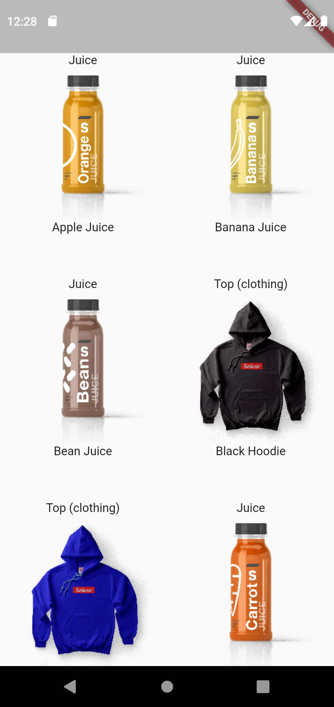
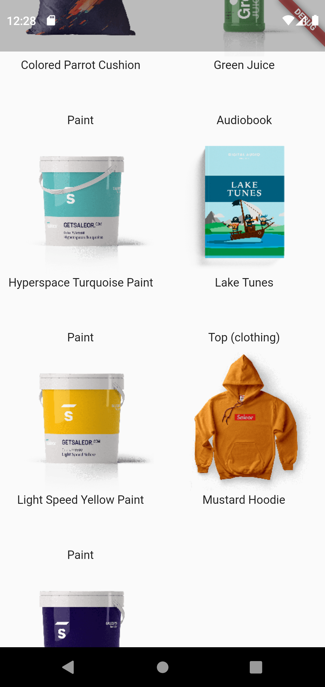

# GraphQL ile verileri gösterme 

## Projede Kullanılan

- GraphQL bağlantısını sağlamak için [hasura_connect](https://pub.dev/packages/hasura_connect) paketini kullandım 
- [Kullandığım GraphQL API adresi](https://demo.saleor.io/graphql/)

